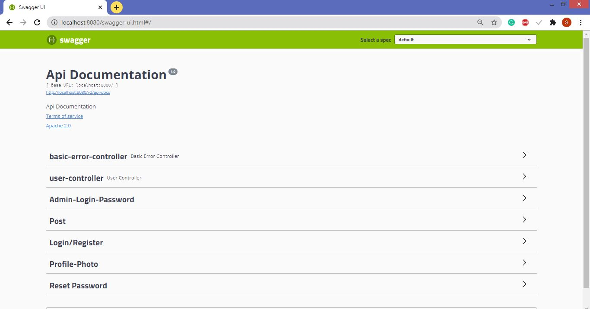

# REST-Api-Implementation-Java_IF
Implemented 10 API's. (Login, Register, ResetPassword(with OTP on mail), UpdatePassword(confirming OTP),ForgotPassword(Admin use only), Show all users, Upload Profile photo(Base64 encryption), Get Profile Photo, Create Blog Posts, Retrieve all Posts)

